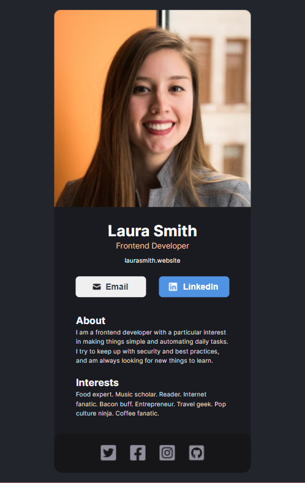

# React -- Business Card

This is a simple business card made with React JS.

## Table of contents

- [Overview](#overview)
  - [The challenge](#the-challenge)
  - [Screenshot](#screenshot)
  - [Links](#links)
- [My process](#my-process)
  - [Built with](#built-with)
  

## Overview

### The challenge

Users should be able to:

- View the optimal layout for the app depending on their device's screen size
- See hover states for all interactive elements on the page

### Screenshot

### Links

- Live Site URL: [https://lidijaalreactbusinesscard.netlify.app/](https://lidijaalreactbusinesscard.netlify.app/)

## My process

### Built with

- HTML
- CSS
- React JS
